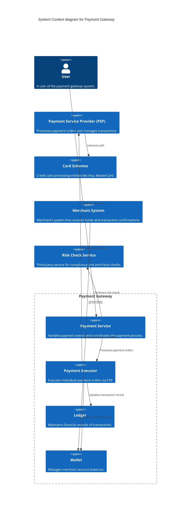

# Context Diagrams
Show the system's context within its environment, including external systems and users.

```mermaid
C4Context
title System Context diagram for Payment Gateway

Person(user, "User", "A user of the payment gateway system.")
System(psp, "Payment Service Provider (PSP)", "Processes payment orders and manages transactions.")
System(cardSchemes, "Card Schemes", "Credit card processing entities like Visa, MasterCard.")
System(merchant, "Merchant System", "Merchant's system that receives funds and transaction confirmations.")
System(riskCheck, "Risk Check Service", "Third-party service for compliance and anti-fraud checks.")
System_Boundary(paygw, "Payment Gateway") {
    System(paymentService, "Payment Service", "Handles payment events and coordinates the payment process.")
    System(paymentExecutor, "Payment Executor", "Executes individual payment orders via PSP.")
    System(ledger, "Ledger", "Maintains financial records of transactions.")
    System(wallet, "Wallet", "Manages merchant account balances.")
}

Rel(user, paymentService, "Initiates payment")
Rel(paymentService, riskCheck, "Performs risk check")
Rel(paymentService, paymentExecutor, "Processes payment orders")
Rel(paymentExecutor, psp, "Executes payment via")
Rel(paymentExecutor, ledger, "Updates transaction record")
Rel(paymentExecutor, wallet, "Updates wallet balance")
Rel(psp, cardSchemes, "Interacts with")
Rel(merchant, wallet, "Receives funds into wallet")
```

