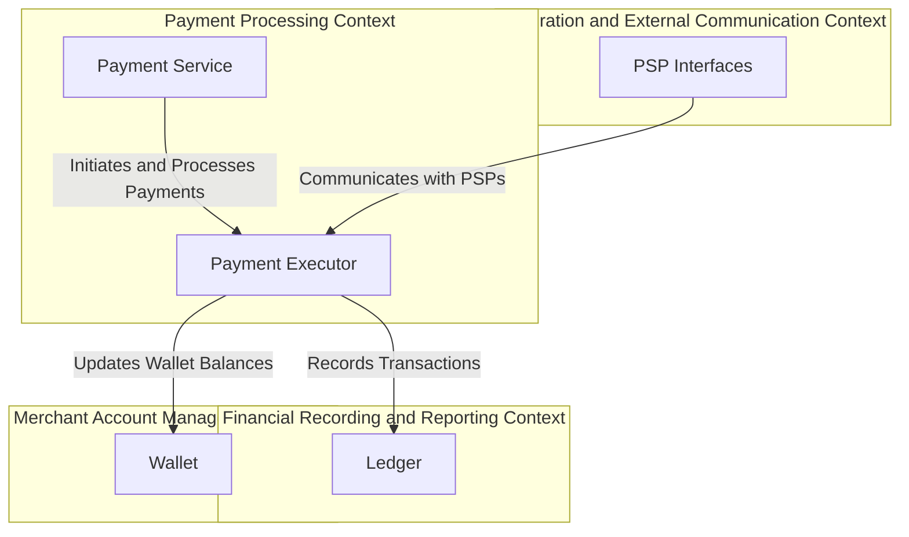

# Bounded Contexts

Each of these bounded contexts encapsulates a specific area of responsibility within the payment gateway solution, with well-defined interfaces for interaction with other contexts. This modular approach aligns with the principles of Domain-Driven Design, ensuring that each context can evolve independently while maintaining a cohesive overall system.

## Payment Gateway Bounded Contexts

### Payment Processing Context
**Scope:** Handling of payment transactions from initiation to completion.  
**Components:** Payment Service, Payment Executor.  
**Responsibilities:** Initiating payment events, executing payment orders, interfacing with PSPs, handling transaction success or failure.

### Financial Recording and Reporting Context
**Scope:** Keeping track of financial transactions for accounting and analysis purposes.  
**Components:** Ledger.  
**Responsibilities:** Recording debits and credits for each transaction, generating financial reports, supporting post-transaction analysis.

### Merchant Account Management Context:
**Scope:** Managing merchant accounts and balances.  
**Components:** Wallet.  
**Responsibilities:** Tracking merchant balances, handling payouts, recording total payments received per merchant.

### Integration and External Communication Context
**Scope:** Managing interactions with external systems like card schemes and banks.  
**Components:** Interfaces with PSPs, Card Schemes.  
**Responsibilities:** Facilitating communication and transactions with external financial systems, handling protocols for different payment methods.

